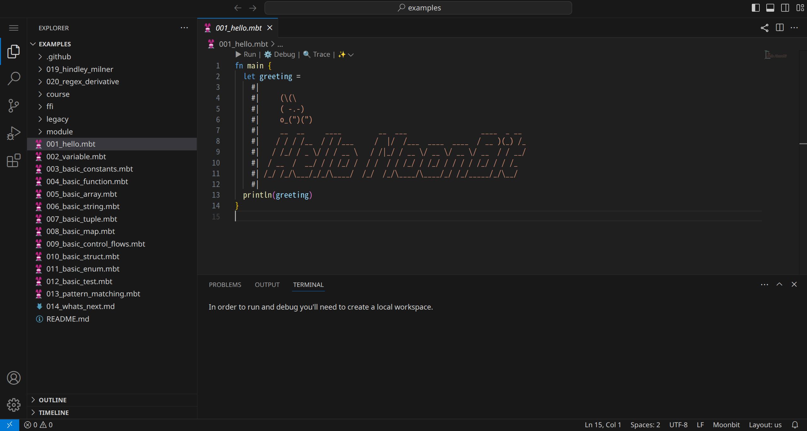
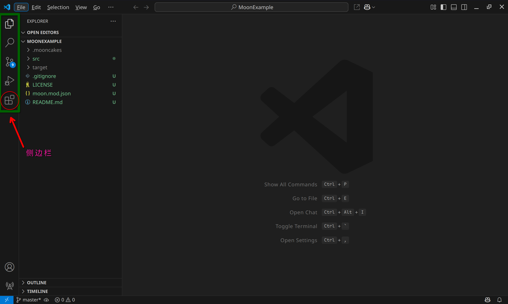
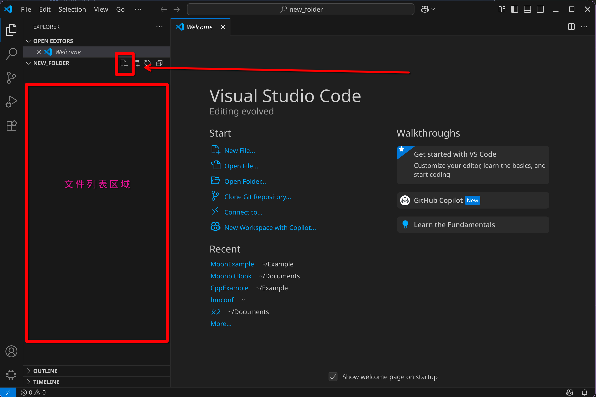
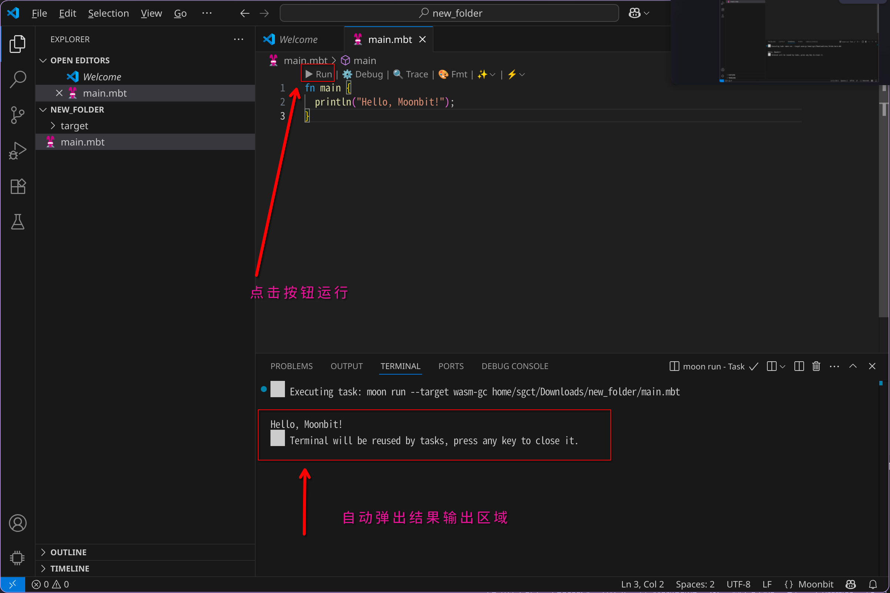
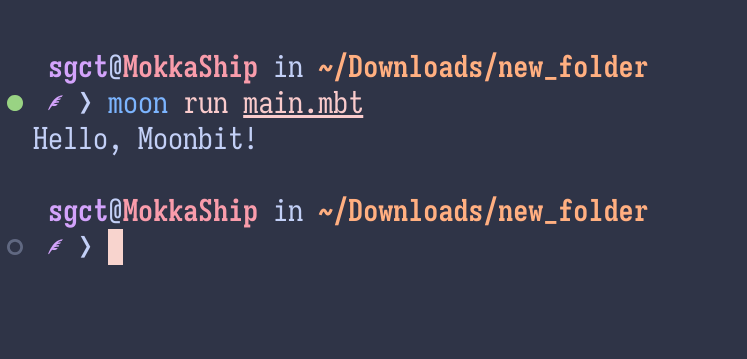
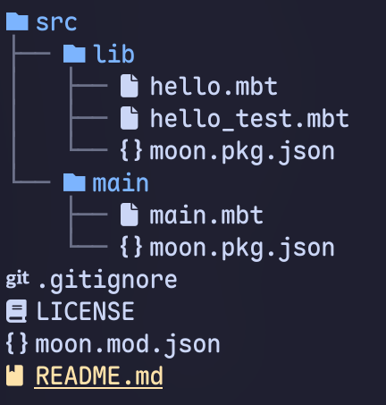

# MoonBit 第一章 编程入门

## 1.1 什么是编程语言

> 编程语言（英语：programming language），是用来定义计算机程序的形式语言。它是一种被标准化的交流技巧，用来向计算机发出指令，一种能够让程序员准确地定义计算机所需要使用数据的计算机语言，并精确地定义在不同情况下所应当采取的行动。[^1]

在学习任何一门编程语言之前，我们都要了解编程语言的定义。可以将计算机视为一种工具，编程语言就是我们与计算机沟通的桥梁。通过编程语言，我们可以告诉计算机我们想要它做什么，如何去做，以及在什么情况下去做。

我们最为常见的任务就是让计算机帮助我们进行*运算*，但计算机的运算能力远不止于此。我们可以通过编程语言来实现各种各样的功能，比如数据处理、图形绘制、网络通信等。但其实计算机根本无法理解我们所说的任何语言，它只能理解二进制代码（0 和 1）。因此，编程语言实际上是人类为计算机设计的一种“翻译器”，它将我们所说的语言翻译成计算机能够理解的语言。

最早期的计算机所能理解的编程语言形式是纸带打孔卡片[^2]


我们可以通过类比计算器来理解早期的计算机，早期的计算机只能设定几条简单的运算规则，比如加法、减法、乘法和除法等。我们可以通过纸带打孔卡片来设定这些运算规则。例如用 010 表示加法，011 表示减法，100 表示乘法，101 表示除法，再通过其他的位置来设定运算的数值。计算机通过读取纸带上的孔洞来判断我们所设定的运算规则和数值，然后进行运算。

但这种方式显然非常麻烦，也非常难记，因此我们需要一种更为简单的方式来与计算机进行沟通。于是，编程语言应运而生。编程语言的出现使得我们可以用更为简单的方式来与计算机进行沟通，而不需要再去记忆那些复杂的二进制代码，但本质上，计算机仍然只能理解二进制代码。

## 1.2 编程语言的分类

编程语言只是一种方便人类理解和编写的中间语言，它最终还是要被翻译成计算机能够理解的二进制代码。而进行这种翻译工作的工具，我们称之为编译器（Compiler）或解释器（Interpreter）。编译器会将整个程序翻译成机器语言，然后再执行；而解释器则是逐行翻译和执行程序。两者的区别在于编译器会将整个程序翻译成机器语言，而解释器则是逐行翻译和执行程序。

对应的，编程语言也可以分为编译型语言和解释型语言。编译型语言在执行之前需要先经过编译器的编译（成为计算机可以理解的二进制形式），而解释型语言则是直接由解释器来执行。


比较典型的编译型语言有 C、C++、Rust 等，比较典型的解释型语言有 Python、Ruby、PHP 等。但其实这两类语言并不是绝对的，很多编程语言都混合使用了这两种技术。例如 Java 语言，它的源代码会先被编译成字节码（Bytecode），然后再由 Java 虚拟机（JVM）来执行。Java 虚拟机本质上就是一个解释器，它会将字节码翻译成机器语言，然后再执行。

编译型语言的优点是执行效率高，因为它们在执行之前已经被编译成机器语言了，所以执行速度非常快；缺点是编译时间长，因为编译器需要将整个程序都编译成机器语言，所以编译时间比较长。

解释型语言的优点是开发效率高，因为它们可以直接执行，所以开发效率比较高；缺点是执行效率低，因为它们在执行的时候需要逐行翻译成机器语言，所以执行速度比较慢。很多解释型语言实现了自己的虚拟机（可以视为向编译型语言进行靠近），例如 Python 和 Java，它们的虚拟机会将源代码编译成字节码，然后再执行。这样做的好处是可以提高执行效率，因为字节码比源代码更接近机器语言。

## 1.3 MoonBit 编程语言

MoonBit 是一个专门为云原生计算和 AI 计算设计的编程语言。它的设计目标是让编程变得更加简单和高效。MoonBit 语言的语法非常简单，易于学习和使用。它的设计灵感来自于 Python 和 JavaScript 等流行的编程语言，但又有自己独特的特点。

MoonBit 是一种**编译型**语言，但是也不仅仅是编译型语言。我们观察到，语言仅仅是一个表示方法，仅仅是一个文件，如何将其翻译为机器代码才是关键。很多语言只拥有一种编译器，或者说一种编译方式，这大大增加了语言跨领域使用的难度。

目前 MoonBit 支持将代码经过不同的后端编译为不同的中间代码，这之间包括基于 WebAssembley 的 Wasm/Wasm GC 后端，C 语言后端，LLVM 后端，和基于 JavaScript 的后端。这使得 MoonBit 可以在不同的平台上运行，包括浏览器、服务器和移动设备，甚至在自主设计的芯片上，这使得它可以与其他编程语言和工具进行无缝集成。

MoonBit 还支持多种编程范式，包括面向对象编程和函数式编程，使得开发者可以根据需求选择最合适的编程风格。

## 1.4 练习与自测

分级练习帮助巩固概念，不要求写 MoonBit 代码（第 1 章重点在认知）。建议先用自己的语言回答，再尝试用更精炼、准确的技术表达。

### 初级练习（理解与回顾）

1. 用不超过 80 字描述：什么是编程语言，为什么需要它（避免直接复制文本）。
2. 列出 6 种你听过的语言，按“主要是编译型 / 主要是解释型 / 混合”三类归类（若不确定可标注“待查”）。
3. 说明纸带打孔方式与现代高级语言之间最大的三个差异（角度：抽象层次 / 可读性 / 错误反馈）。
4. 写出编译器与解释器的流程差异：用 4–6 个步骤分别表示（例如：源代码 → ？ → ？）。
5. 描述 MoonBit 支持多后端的两个直接好处（部署场景、性能或平台覆盖）。

### 进阶练习（迁移与比较）

6. 对比 Python 与 MoonBit 的“从源码到执行”路径，各列关键中间形式（如：字节码 / 机器码 / Wasm）。
7. 设想一个需要同时在浏览器与边缘设备运行的应用：说明 MoonBit 多后端如何减少维护成本。
8. 若你要向完全不懂编程的朋友解释“编译型 vs 解释型”的区别，请拟一个生活类比（非“翻译”类比再造一个）。
9. 列出你学习过的语言中一个特性，在 MoonBit 中你期望它如何体现（例如：模式匹配、异步等）。
10. 从“云原生 + AI”角度推测 MoonBit 设计目标的三条非功能性需求（比如：启动速度、可移植性、可测试性）。

> 提示：答案不唯一；关键在于清晰、具体而非套话。可将答案保存到单独笔记文件，后续第 14 章再回顾你的认知变化。

[^1]: [编程语言 - 维基百科，自由的百科全书](https://zh.wikipedia.org/zh-cn/编程语言)
[^2]: [打孔带 - 维基百科，自由的百科全书](https://zh.wikipedia.org/wiki/打孔带)


---

## MoonBit 第二章 运行第一个 MoonBit 程序

## 2.1 配置 IDE

编辑器类似于记事本，可以理解为更加漂亮的记事本。编译器类似于一个翻译器，可以将 MoonBit 代码翻译成机器语言。IDE 就是集成开发环境（Integrated Development Environment），它将编辑器和编译器集成在一起，提供了一个完整的开发环境。

MoonBit 官方推荐了两种方法来配置开发环境：使用在线编程环境和本地安装 VSCode 编辑器。如果使用在线环境，是一个完整的 IDE，直接在浏览器中编写和运行代码即可；如果使用本地编辑器，则需要安装 VSCode 编辑器和 MoonBit 插件和 MoonBit 编译器。

### 2.1.0 在线编程环境

MoonBit 有一个非常好用的在线体验网站，如果是前期学习阶段，可以直接在上面进行编程练习。这个网站是一个在线的编程环境，可以让我们在浏览器中编写和运行 MoonBit 代码，而不需要安装任何软件。

[https://try.moonbitlang.cn/](https://try.moonbitlang.cn/)



在这个网站可以满足绝大多数 MoonBit 的学习需求。我们可以在上面编写代码、运行代码、查看输出结果等。这个网站还提供了很多示例代码，可以帮助我们更好地理解 MoonBit 的语法和用法。

### 2.1.1 安装 VSCode 编辑器

为了方便后续的编码任务，MoonBit 官方推荐使用 VSCode 作为编程工具。VSCode 是一个免费的开源代码编辑器，支持多种编程语言和插件。通过安装 MoonBit 插件，我们可以在 VSCode 中编写和运行 MoonBit 代码。

#### 2.1.1.1 在 Windows 上安装 VSCode

1. 下载并安装 VSCode：[VSCode 官网](https://code.visualstudio.com/)
2. 如果你使用的是 Windows 系统，可以在下载后点击 exe 文件进行安装。高于 Windows 10 的系统可以在终端里使用 winget 命令安装。

```bash
winget install -e --id Microsoft.VisualStudioCode
```

#### 2.1.1.1 在 Linux 上安装 VSCode


如果你使用的是 Debian/Ubuntu/Linux Mint 等 Linux 系统，可以下载 deb 文件进行安装。

```bash
sudo apt install ./<file>.deb
```

如果使用的是基于 RHEL 的系统（如 CentOS、Fedora、AlmaLinux 等），可以下载 rpm 文件进行安装。

```bash
 sudo dnf install ./<file>.rpm
```

其他操作系统可以参考 _VSCode 官网_<https://code.visualstudio.com/docs/setup/setup-overview> 进行安装。

#### 2.1.2 安装 MoonBit 插件

安装完 VSCode 后，我们需要安装 MoonBit 插件。MoonBit 插件可以让我们在 VSCode 中编写和运行 MoonBit 代码。

1. 打开 VSCode，点击左侧的扩展图标（或按下 `Ctrl+Shift+X`）。
   

2. 在搜索栏输入 moonbit，并点击安装（Install），注意作者必须是 MoonBit
   

   > （可选步骤）如果你希望 VSCode 的语言是中文，可以安装中文语言包，具体的操作方式与安装 MoonBit 插件一样，在搜索栏输入 chinese 并安装，注意作者必须得是 Microsoft（微软公司）
   > 

3. 安装完成后，最好先重启一下 VSCode 以便插件生效。

## 2.1.3 安装 MoonBit 编译器

MoonBit 编译器是将 MoonBit 代码编译成机器语言的工具。
MoonBit 官方提供了多种安装方式，以下是常用的两种方式：

1. 如果你刚刚安装了 VSCode 以及 MoonBit 插件，可以直接使用插件提供的一键自动下载安装的方式，
   在 VSCode 中按下 `Ctrl+Shift+P`，输入 `moonbit`，找到 `MoonBit: Install Compiler`字样的内容，然后按下回车键即可。
   

2. 如果你是一个高级用户，不需要用 VSCode，可以直接在终端中使用命令行安装 MoonBit 编译器。MoonBit 官方提供了多种安装方式，以下是常用的两种方式：

   - 在 Linux&MacOS 使用 `curl` 命令下载并安装 MoonBit 编译器：

```bash
curl -fsSL https://cli.moonbitlang.cn/install/unix.sh | bash
```

- 在 Windows 上使用 `PowerShell` 命令下载并安装 MoonBit 编译器：

```powershell
Set-ExecutionPolicy RemoteSigned -Scope CurrentUser; irm https://cli.moonbitlang.cn/install/powershell.ps1 | iex
```

这两种安装方式没有什么区别，都是将 MoonBit 编译器安装到系统中。安装完成后，可以在终端中输入 `moonbit --version` 来检查是否安装成功。（如果没有可以考虑注销用户重新登录）

## 2.2 编写第一个 MoonBit 程序

现在我们已经安装好了 MoonBit 的开发环境，可以开始编写第一个 MoonBit 程序了。我们将编写一个简单的程序，输出 "Hello, MoonBit!"。

如果使用在线环境，可以直接打开浏览器，进入 [MoonBit 在线编程环境](https://try.moonbitlang.cn/)。如果使用本地环境，可以在 VSCode 中打开一个新的空文件夹，作为新的工作区。

然后在文件列表中新建一个文件，命名为 `main.mbt`。



在这个文件中输入以下代码：

```moonbit no-check
fn main {
  println("Hello, Moonbit!");
}
```

点击运行按钮


或者你也可以打开终端，在其中输入以下命令来运行程序,这和你点击按钮是一样的效果：



恭喜你，你已经成功编写并运行了第一个 MoonBit 程序！你应该能在输出区域看到 "Hello, MoonBit!" 的字样。

## 2.3 使用 `moon` 来管理工程

刚刚我们的例子是运行了一个单文件的简单的 MoonBit 程序，但在实际开发中，我们通常会有多个文件和更复杂的项目结构。MoonBit 提供了一个命令行工具 `moon` 来帮助我们管理这些项目。
`moon` 工具可以帮助我们创建、编译和运行 MoonBit 项目。它提供了一些常用的命令，可以让我们更方便地管理项目。

在当前目录下，可以使用`moon new <名称>`的命令来创建一个新的 MoonBit 项目。例如，我们可以创建一个名为 `my_project` 的项目：

```bash
moon new my_project
```

这个命令会在当前目录下创建一个名为 `my_project` 的文件夹，并在其中生成一些默认的文件和目录结构。你可以进入这个文件夹，查看里面的内容：



> 在理解项目结构时，先无需理解语法，首先掌握项目的目录结构和文件的含义是非常重要的。下面我们来逐一介绍这些文件和目录。

在这个项目中，存在两个重要的部分，一个是库代码，一般成为 lib 或者 library，另一个是可执行代码，一般称为 bin 或者 binary，这个概念在任何编程语言里都有。

可执行程序的含义是一个需要被运行的程序，它通常包含一个入口函数（如 `main` 函数），运行它就会发生一些预期的行为，比如展示一个窗口，或者输出一些信息。而库代码则是一些可以被其他程序调用的函数或类，它们通常不包含入口函数，而是提供一些功能供其他程序使用。

总结一下，即可执行程序可以调用库实现更加高级的功能，库代码既可以被可执行程序调用，也可以被其他库调用。

#### 项目根目录

##### .gitignore

- 含义: 这个文件告诉 Git 版本控制系统在提交代码时应该忽略哪些文件和文件夹。

##### LICENSE

- 含义: 这是项目的开源许可证文件，默认使用 Apache-2.0 许可证。它规定了项目的使用、修改和分发的条款。

##### moon.mod.json

- 含义: 这是 MoonBit 项目的模块配置文件，定义了整个项目的元数据。
- 内容:
  - name: "username/hello" - 模块的名称，通常采用 用户名/项目名 的格式。
  - version: "0.1.0" - 项目的当前版本。
  - license: "Apache-2.0" - 项目的许可证类型。
  - source: "src" - 指定源代码位于 src 目录下。

##### README.md

- 含义: 项目的说明文档，通常包含项目的简介、如何安装和使用等信息。
- 内容: 目前只包含一行标题：# username/hello。

#### src/lib 目录 (库代码)

##### src/lib/moon.pkg.json

- 含义: 这是 lib 包的 MoonBit 包配置文件。
- 内容: 文件内容为空 {}，表示这是一个标准的库包，没有特殊的配置。

##### src/lib/hello.mbt

- 含义: 这是库的核心源文件，定义了一个公共函数。
- 内容:

```moonbit
pub fn hello() -> String {
    "Hello, world!"
}
```

代码定义了一个名为 hello 的公共函数 (pub fn)，该函数没有参数，返回一个 String 类型的值，其内容是 "Hello, world!"。

##### src/lib/hello_test.mbt

```moonbit no-check
test "hello" {
  if @lib.hello() != "Hello, world!" {
    fail("@lib.hello() != \"Hello, world!\"")
  }
}
```

- 含义: 这是 hello 函数的测试文件。
- 内容:

```moonbit no-check
test "hello" {
  if @lib.hello() != "Hello, world!" {
    fail("@lib.hello() != \"Hello, world!\"")
  }
}
```

代码定义了一个名为 "hello" 的测试用例。它调用 @lib.hello() 函数，并检查返回值是否等于 "Hello, world!"。如果不相等，测试将失败并报告错误信息。

#### src/main 目录 (可执行代码)

##### src/main/moon.pkg.json

- 含义: 这是 main 包的 MoonBit 包配置文件，定义了可执行程序的属性。
- 内容:
  - "is-main": true: 指定这个包是一个可执行程序（而不是一个库）。
  - "import": ["username/hello/lib"]: 声明该包依赖（导入）了 username/hello/lib 这个库包，以便使用其中定义的函数。

##### src/main/main.mbt

- 含义: 这是程序的主入口文件。
- 内容:

```moonbit no-check
fn main {
    println(@lib.hello())
}
```

代码定义了 main 函数，这是程序的执行起点。它调用了从 lib 包导入的 hello 函数 (@lib.hello())，并使用 println 将其返回值 "Hello, world!" 打印到控制台。

根据上方的总结，我们可以看出，这个项目的结构是非常清晰的。`src/lib` 目录下存放的是库代码，`src/main` 目录下存放的是可执行代码。库代码可以被可执行代码调用，也可以被其他库调用。而可执行代码则是整个项目的入口点，负责调用库中的函数并输出结果。

在实际的工程中，库和可执行代码的分离可以让我们更好地组织代码，提高代码的复用性和可维护性。我们可以将一些通用的功能封装成库，然后在不同的项目中使用这些库，而不需要重复编写相同的代码。当然，你也可以创建一个纯粹的代码库，或者一个纯粹的可执行程序，具体取决于你的需求。

但对于库代码，测试是非常重要的。我们可以在 `src/lib` 目录下编写测试代码，确保库中的函数在各种情况下都能正常工作。测试代码通常以 `<文件名>_test.mbt` 结尾（注意必须存在对应的`<文件名>.mbt`），MoonBit 会自动识别并运行这些测试。

> 在学习阶段，你可以不使用工程结构，直接在单个文件中编写和测试代码。但是一旦你开始编写更复杂的程序，或者需要复用某些功能时，使用工程结构将会大大提高你的开发效率和代码质量。

## 2.4 练习与自测

### 初级练习

1. 在在线环境中修改 Hello 示例，让它多打印一行当前“练习编号”。
2. 使用 `moon new demo_cli` 创建一个新项目，列出生成的 4 个关键文件及其作用（不看本章再回忆）。
3. 在新项目 `lib` 中添加函数 `goodbye() -> String` 返回 "Goodbye"，在 `main.mbt` 中一起打印 `hello()` 与 `goodbye()`。
4. 修改示例测试：为 `goodbye()` 写一个新测试并让它通过。
5. 运行 `moon test`（或插件里测试命令）并记录成功输出的大致格式。

### 进阶练习

6. 故意让一个测试失败：修改期望值后观察报错信息，再恢复。总结报错中最有用的两点信息。
7. 说明为什么需要将库代码与可执行代码分离：请从“复用 / 依赖管理 / 测试隔离”三个角度写出各 1 句话。
8. 设想要把项目同时运行在浏览器与服务器：多后端如何帮助你减少额外构建脚本？
9. 为 `moon.mod.json` 设想两个未来可能增加的字段（例如：作者、编译目标列表），并说明用途。
10. 撰写一个最小的“项目维护清单”（不少于 5 项），描述在多人协作下如何保持目录结构整洁。

> 提示：第 2 章重在“环境与结构”操作熟悉；多写、把步骤记录下来，有助于后续自动化（脚本/文档）。参考答案方向将收录在 `appendix/answers.md`。


---

## 第 3 章 数据类型

在日常生活中，我们通过“分类”来认识世界：这是数字，那是文字；这是“真”的，那是“假”的。

在编程世界里，我们把这些分类称为**数据类型**。MoonBit 就像一个细心的管家，它要求我们在处理数据之前，先明确这个数据“是什么类型”。这样做的好处是，管家可以帮我们检查错误——比如，它会阻止你把“文字”和“数字”强行加在一起。

本章我们将用最通俗易懂的方式，带你认识 MoonBit 中最基础、最常用的几种数据类型。

## 3.0 什么是数据类型？

让我们先看一个简单的例子：

> **“苹果”是“水果”**

在这句话里：

- **“苹果”** 是一个具体的东西（我们称之为**值**）。
- **“水果”** 是这一类东西的统称（我们称之为**类型**）。

在编程中也是一样：

- `100` 是一个具体的值，它的类型是 **整数**。
- `"你好"` 是一个具体的值，它的类型是 **字符串**。

数据类型就像是给数据贴上的标签，告诉计算机：“这是一个数字，你可以拿它做加减法”或者“这是一段文字，你可以把它打印出来”。

---

## 3.1 Unit 类型：表示“这就完事了”

### 这是什么？

想象一下，你让朋友帮你做两件事：

1. **“帮我算一下 1 加 1 等于几？”** 朋友会回答你：“2”。这里有一个有意义的结果（数字 2）。
2. **“帮我把灯关一下。”** 朋友走过去关了灯。这件事做完了，但并没有产生一个新的“数字”或“文字”给你，只是事情**做完了**。

在 MoonBit 中，像“关灯”这种“只做事、不产生具体结果”的情况，也有一个专门的类型，叫做 `Unit`。

### 它的样子

- **类型名字**：`Unit`
- **它的值**：`()` （看起来像一对空荡荡的小括号，表示“空空如也”）

### 什么时候遇到？

当你写一段代码，主要目的是为了**产生某种效果**（比如在屏幕上打印一行字），而不是为了计算出一个数时，这段代码的结果通常就是 `Unit`。

```moonbit expr
fn main {
  // println 这个命令负责在屏幕上显示文字
  // 它做完这件事就结束了，不会这就给你变出一个数字来
  // 所以它的结果就是 ()
  println("Hello!")
}
```

---

## 3.2 Bool 类型：非真即假

### 这是什么？

这是最简单直接的类型，只有两种可能：**对**（真）或者**错**（假）。就像回答“是/否”问题一样。

### 它的样子

- **类型名字**：`Bool` (布尔值)
- **它的值**：只有两个 —— `true` (真) 和 `false` (假)。

### 怎么玩？

你可以像做逻辑题一样组合它们：

- **并且 (`&&`)**：只有两边都为真，结果才为真。（我想去玩 **并且** 天气好 -> 我才去）
- **或者 (`||`)**：只要有一边为真，结果就为真。（今天是周末 **或者** 我请假了 -> 我都不用上班）
- **不 (`not`)**：黑变白，白变黑。（**不**是下雨天 -> 那就是没下雨）

```moonbit expr
fn main {
  let is_weekend = false  // 不是周末
  let is_holiday = true   // 但是是节假日

  // 是周末 或者 是节假日，都可以休息
  let can_rest = is_weekend || is_holiday

  println(can_rest) // 输出: true (真，可以休息！)
}
```

---

## 3.3 整数类型：没有小数点的数字

### 这是什么？

就是我们在数学课上学的**整数**：0, 1, 2, 100, -5 等等。不带小数点。

### 它的样子

MoonBit 里有几种不同大小的“盒子”来装整数，最常用的是：

- **`Int`**：最常用的整数类型。就像一个**普通的背包**，日常用的数字都能装得下。具体的范围为 -2,147,483,648 到 2,147,483,647。
- **`Int64`**：超大整数。就像一个**集装箱**，如果你的数字特别特别大（比如全世界人口总数，或者宇宙里的星星数量，或者进行很大的数学运算），用它。
- **`Byte`**：微型整数。就像一个**火柴盒**，只能装 0 到 255 之间的数字。

### 注意事项

MoonBit 很严格，**不同大小的盒子不能混着用**。你不能直接把“集装箱”里的东西倒进“背包”里，必须显式地告诉它“我要转换一下”。

```moonbit expr
fn main {
  let small_num : Int = 10
  let big_num : Int64 = 100L // 数字后面加 L 表示这是个大整数

  // 下面这行会报错！因为一个是 Int，一个是 Int64
  // println(small_num + big_num)

  // 正确做法：先把 Int 变成 Int64，再相加
  println(small_num.to_int64() + big_num)
}
```

---

## 3.4 浮点数类型：带小数点的数字

### 这是什么？

就是**小数**。比如 3.14, 0.5, -1.2。因为小数点可以在数字间“浮动”（科学计数法），所以叫浮点数。

### 它的样子

- **`Double`**：双精度浮点数。这是默认的小数类型，精度比较高。
- **`Float`**：单精度浮点数。占空间小，但精度稍微低一点。

### 小心陷阱！

计算机存小数有时候存不准（就像 1/3 永远写不完一样）。
比如 `0.1 + 0.2` 在计算机里可能不完全等于 `0.3`，而是一个极度接近 `0.30000000000000004` 的数。所以，**不要直接判断两个小数是否完全相等**。

> 尝试一下下面的代码，看看结果是什么：

```moonbit expr
fn main {
  let price = 9.99
  let discount = 0.8
  let final_price = price * discount
  println(final_price)
}
```

---

## 3.5 String 类型：字符串

### 这是什么？

**字符串**就是一串字符连在一起，用来表示文本。就像项链（String）把一颗颗珠子（字符）串起来一样。

### 它的样子

- 用双引号括起来：`"你好，MoonBit"`
- **类型名字**：`String`

### 怎么玩？

最常用的功能是**插值**（填空题）。你可以在字符串里挖个坑，把变量填进去。

```moonbit expr
fn main {
  let name = "小明"
  let age = 18

  // \{name} 就是挖的坑，把 name 变量的值填进去
  let intro = "大家好，我是\{name}，今年\{age}岁。"

  println(intro)
  // 输出：大家好，我是小明，今年18岁。
}
```

---

## 3.6 Char 与 Bytes：单个字符与原始数据

这一节稍微高级一点点，初学者只需了解即可。

- **`Char` (字符)**：如果说 String 是一串项链，Char 就是项链上的**这一颗珠子**。它用单引号表示，比如 `'A'` 或 `'中'`。
- **`Bytes` (字节序列)**：这是给计算机看的“原始数据”。如果你要处理图片文件或者网络数据包，才会用到它。平时我们用 String 就够了。

---

## 3.7 元组 (Tuple)：固定搭配的套餐

### 这是什么？

有时候你想把几个**不同类型**的东西捆绑在一起，当成一个整体。
比如：一个学生的记录，包含“姓名”（文字）和“分数”（数字）。

### 它的样子

用圆括号括起来，中间用逗号分隔：`("小红", 98)`。

### 怎么玩？

就像买快餐套餐，你可以一次拿到汉堡和可乐。

```moonbit expr
fn main {
  // 定义一个元组：(String, Int)
  let student = ("小红", 98)

  // 访问里面的东西：用 .0 拿第一个，.1 拿第二个
  println(student.0) // 输出：小红
  println(student.1) // 输出：98

  // 或者直接把它们拆开（解构）
  let (name, score) = student
  println("姓名: \{name}, 分数: \{score}")
}
```

---

## 3.8 数组 (Array)：一排储物柜

### 这是什么？

如果你有一堆**相同类型**的东西要存，比如全班 50 个人的分数，用元组就不合适了。这时候用**数组**。
数组就像一排编号的储物柜，每个柜子大小一样，里面放的东西类型也必须一样。

### 它的样子

用方括号括起来：`[1, 2, 3, 4, 5]`。

### 怎么玩？

- **编号从 0 开始**：第一个柜子是 0 号，第二个是 1 号...
- **可以修改**：你可以把 0 号柜子里的东西拿出来，换个新的进去。

```moonbit expr
fn main {
  let scores = [80, 90, 95]

  // 拿出第 2 个分数（编号为 1）
  println(scores[1]) // 输出 90

  // 修改第 1 个分数（编号为 0）
  scores[0] = 85
  println(scores[0]) // 输出 85
}
```

---

## 3.9 Option 类型：神奇的盲盒

### 这是什么？

这是 MoonBit 里非常棒的一个设计！
在很多编程语言里，如果你想表示“这里没有值”，很容易导致程序崩溃（著名的“空指针异常”）。
MoonBit 用一种更安全的方式：**Option（选项）**。

想象一个盒子，这个盒子可能：

1. **装了一个东西** (`Some(值)`)
2. **是空的** (`None`)

当你处理这个盒子时，MoonBit 会强迫你必须考虑“如果是空的怎么办？”这样你就永远不会因为忘记检查空值而让程序崩溃了。

### 它的样子

- `Some(100)`：盒子里有个数字 100。
- `None`：盒子是空的。

### 怎么玩？

你需要“打开盒子”看看里面有没有东西。

```moonbit expr
fn main {
  // 假设这是一个可能为空的盒子
  let box : Option[Int] = Some(100)

  // 使用 match (匹配) 来打开盒子
  match box {
    Some(value) => println("盒子里有东西，是：\{value}")
    None => println("盒子是空的！")
  }
}
```

---

## 3.10 小结

恭喜你！你已经认识了 MoonBit 世界里的主要居民：

- **Unit**：表示“事情做完了，没啥结果”。
- **Bool**：表示“真”或“假”。
- **Int/Double**：表示“整数”或“小数”。
- **String**：表示“文字”。
- **Tuple**：把不同东西打包成“套餐”。
- **Array**：把同类东西排成“队列”。
- **Option**：安全的“盲盒”，处理可能为空的情况。

掌握了这些，你就拥有了构建程序大厦的砖块。下一章，我们将学习如何用**函数**来指挥这些数据动起来！


---

## 第 4 章 函数与程序结构

本章目标：彻底掌握 MoonBit 中函数的定义、调用、参数形式（普通参数、带标签参数、可选参数与默认值）、返回值规则、局部/匿名/箭头函数、闭包、部分应用与代码组织风格。我们不假设你已经会其它语言的函数概念；所有术语都重新解释。请边看边敲，每个代码块都可以单独运行。

---

## 4.1 为什么需要函数？

直觉：没有函数，代码会像一条长长的流水账，难以阅读、复用、测试。函数让我们可以把“逻辑片段”打包，给它名字（语义），并在需要时调用。函数同时是：

- 可重复执行的代码单元（复用性）
- 拥有输入（参数）与输出（返回值）的“转换器”
- 组织复杂程序的最小结构砖块

数学类比：数学里的 f(x)=x+1 与编程里的 `fn inc(x : Int) -> Int { x + 1 }` 极其相似 —— 输入一个 `x`，得到一个新值。

---

## 4.2 基本函数定义与调用

语法最小形式：

```moonbit expr
fn name(param1 : Type1, param2 : Type2) -> ReturnType {
  <函数体，最后一个表达式的值即返回值>
}
```

如果没有输入参数，则省略括号内内容，但是返回指类型仍然是必要的。

### 示例：最小与带返回值

```moonbit expr
fn greet() -> Unit {
  println("Hello, MoonBit!")  // 返回 Unit
}

fn add(x : Int, y : Int) -> Int {
  x + y   // 最后一个表达式是返回值
}

fn main {
  greet()
  let s = add(3, 4)
  println(s)
}
```

要点：

- 不写 `return`；最后一个表达式的值自动成为返回值。
- 无参函数调用时可以写 `greet()` 或仅写 `greet`（风格上推荐加括号保持一致性）。

### 初学者常见误区

- 把“打印结果”误当成“函数返回值”——打印只是副作用，返回值要看函数体最后的表达式。
- 写了多余的 `return`（若语言暂未支持或不需要），保持表达式风格即可。

### 练习 4-1

1. 写一个函数 `square(n : Int) -> Int` 返回 `n*n`；在 `main` 中调用并打印 5 的平方。
2. 写一个函数 `hello(name : String) -> String` 返回拼好的问候语，不打印，交给调用者打印。

---

## 4.3 `main` 与 `init` 特殊入口

- `main`：程序唯一入口，无参数，无返回值，用来启动整体流程。
- `init`：可有多个，在 `main` 之前执行，用于资源或状态初始化。不要依赖多个 `init` 的执行顺序。

```moonbit expr
fn init() -> Unit { println("[init] setup...") }
fn init() -> Unit { println("[init] second init...") }
fn main() -> Unit { println("[main] running") }
```

图示（概念）：

```
  init1 → init2 → ... → main → 结束
```

库（供别人调用的包）中不可以写 `main`；可执行程序必须有且仅有一个 `main`。

### 练习 4-2

- 写两个 `init`（将其顺序打乱，或者放在`main`后面），分别打印不同信息，以及一个 `main`。运行观察顺序（顺序不保证，记录你的实际输出）。

---

## 4.4 参数与类型注解

形式：`x : Int` 表示“x 的类型是 Int”。编译器据此做类型检查。

```moonbit expr
fn concat(a : String, b : String) -> String { a + b }
fn main { println(concat("A", "B")) }
```

省略返回类型：若返回 `Unit` 可不写；但为可读性，复杂函数建议显式标注返回类型。

---

## 4.5 带标签的参数（命名参数）

标签语法：`name~ : Type`。调用时用 `name="Alice"`。

优势：不需要记住参数位置顺序；读调用代码即知每个值的意义。

```moonbit expr
fn create_user(name~ : String, age~ : Int, email~ : String) -> String {
  "User(name: \{name}, age: \{age}, email: \{email})"
}

fn main {
  let u1 = create_user(age=30, name="Alice", email="alice@example.com")
  let name = "Bob"
  let age = 18
  let email = "bob@example.com"
  let u2 = create_user(name~, age~, email~) // 变量名与标签相同的简写
  println(u1)
  println(u2)
}
```

注意：把顺序写错不影响结果（因为按标签匹配），但若某个标签漏写或拼错会报错；仔细核对。

用此种方式定义的函数，调用时**必须**使用标签。输入参数的顺序可以任意。但是标签名称必须正确无误，如果你当前定义了一个名称与标签相同的变量，可以使用简写形式 `name~` 来传递该变量的值。

```moonbit expr
let u2 = create_user(name~, age~, email~) // 变量名与标签相同的简写
```

当然你也可以使用完整形式：

```moonbit expr
let u2 = create_user(name=name, age=age, email=email)
```

### 练习 4-3

- 设计一个 `make_point(x~ : Int, y~ : Int) -> String`，在调用时交换书写顺序验证不受影响。

---

## 4.6 可选参数与默认值

可选参数的意思是调用时可以省略该参数（但实际上这个参数肯定是要传入的），函数内部会收到一个 `Option` 类型（`Some(value)` 或 `None`）。默认值参数则是在调用时省略该参数时，函数会使用预设的默认值，如果没有预设默认值则使用`None`。

注意：只有带标签参数才能使用可选与默认值。
两种方式：

1. 直接写默认值：`greeting? : String = "Hello"`。（注意此处`~` 变为`?`）
2. 使用 `?` 语法：`width? : Int` 自动成为 `Option[Int]`；调用省略则为 `None`，传值自动打包为 `Some(value)`。

```moonbit expr
fn greet(name~ : String, greeting? : String = "Hello") -> String {
  "\{greeting}, \{name}!"
}

fn create_rectangle(width? : Int, height? : Int) -> String {
  let w = match width {
    Some(v) => v
    None => 10
  }
  let h = match height {
    Some(v) => v
    None => 10
  }
  "Rect \{w}x\{h}"
}

fn main {
  println(greet(name="Alice"))
  println(greet(name="Bob", greeting="Hi"))
  println(create_rectangle())
  println(create_rectangle(width=20))
  println(create_rectangle(width=20, height=5))
}
```

设计选择：使用 `?` 参数时内部必须处理 `Option`；若只是单纯默认值，直接用带默认的标签更简单。这种设计让调用者更清晰地知道哪些参数是可选的，同时也让函数实现者有更多灵活性去处理缺省情况。相比于`C/C++`中的指针或`Java`中的`null`，这种方式更安全，避免了空指针异常的问题。

### 练习 4-4

- 写 `area(width? : Int, height? : Int)` 默认 10，返回字符串 `"WxH"`。
- 写 `greet2(name~ : String, punctuation~ : String = ".")`，再测试省略与提供不同标点。

---

## 4.7 部分应用函数（Partial Application）

有的时候我们想把一个多参数函数“变成”一个少参数函数，在数论中称为“柯里化”（Currying）。MoonBit 支持通过部分应用来实现这一点。一般的高阶函数式编程语言都会支持这种特性。这种情况下，看似调用了某个函数，但实际上这个函数并没有被立即调用，而是返回了一个新的函数，这个新函数将等待剩余的参数。

用下划线 `_` 作为占位符固定部分参数，得到新函数：

```moonbit expr
fn add(x : Int, y : Int) -> Int { x + y }
fn main {
  let add10 = add(10, _)
  println(add10(5))  // 15
}
```

再看多参数：

```moonbit expr
fn multiply(x : Int, y : Int, z : Int) -> Int { x * y * z }
fn main {
  let times2and3 = multiply(_, 2, 3)
  println(times2and3(4)) // 24
}
```

部分应用函数也可以作用于**带标签参数**，唯一的区别是得将这个标签写上，如下所示：

```moonbit expr
fn add(x : Int, y? : Int = 10) -> Int {
  return x + y
}

fn main {
  let add10 = add(10, y=_)
  println(add10(5)) // 15
}
```

### 练习 4-5

- 用部分应用函数写一个 `inc`（基于 `add`）。
- 基于 `multiply` 构造一个函数固定后两个参数为 5 和 6，再调用测试。

---

## 4.8 匿名函数与箭头函数

匿名函数是一种特殊的函数，它没有名字（但是可以作为一个变量），通常用于临时场合，比如作为参数传递给高阶函数。MoonBit 支持两种形式的匿名函数：

匿名函数：`fn(x) { x * 2 }`；箭头函数：`x => x * 2` 更简洁。

```moonbit expr
fn main {
  let nums = [1, 2, 3]
  let doubled = nums.map(fn(n) { n * 2 })
  let squared = nums.map(n => n * n)
  println(doubled)
  println(squared)
}
```

> 在该实例中，`map` 函数接受一个函数作为参数，并对数组中的每个元素应用该函数。我们使用了匿名函数和箭头函数来实现这一点。这其实是包含在标准库中的数组部分的函数，任意数组都可以调用 `map` 方法。

选择：简单单表达式用箭头；多语句或需要局部绑定，用块状 `fn(...) { ... }`。

匿名函数还可以作为变量赋值：

```moonbit expr
fn main {
  let add = fn(x : Int, y : Int) -> Int { x + y }
  let result = add(3, 4)
  println(result)
}
```

箭头函数作为匿名函数的简写形式：

```moonbit expr
fn main {
  let add = (x, y) => x + y
  let result = add(3, 4)
  println(result)
}
```

在匿名函数中，不写返回类型时，编译器会根据函数体自动推断返回类型，如果不能推断则会报错。

如下的程序是无法编译通过的

```moonbit expr
fn main {
  let add = (x, y) => x + y
}
```

因为没有人使用 `add` 函数，编译器无法推断出 `x` 和 `y` 的类型，从而导致编译错误。你可以通过调用 `add` 函数并传入具体的参数来解决这个问题。

### 练习 4-6

- 用匿名函数与箭头函数各自实现把 `[1,2,3]` 转成其立方。

---

## 4.9 闭包

闭包是一类特殊的匿名函数，它可以“捕获”其定义环境中的变量，从而在函数体内使用这些变量。闭包允许我们创建具有状态的函数，这在很多场景下非常有用。

在当前环境中，`create_counter` 定义了一个闭包 `fn() { c = c + 1; c }`，它捕获了外部变量 `c`。每次调用返回的函数时，都会访问并修改这个捕获的变量 `c`。

```moonbit expr
fn create_counter(start : Int) -> () -> Int {
  let mut c = start
  fn() { c = c + 1; c }
}
fn main {
  let counter = create_counter(10)
  println(counter())
  println(counter())
}
```

`c` 在返回后仍存在于闭包环境中。副作用提醒：频繁修改捕获变量会让逻辑难以跟踪；能用纯函数就用纯函数。有捕获的闭包是非常危险的，因为它们会引入隐藏的状态变化，可能导致难以预料的行为。建议仅在必要时使用，并确保理解其工作原理。但有的时候危险与便利是并存的。

### 练习 4-7

- 写一个 `make_adder(base : Int)` 返回 `(Int) -> Int`，每次调用加上 base。

---

## 4.10 高阶函数（HOF）

在每一个函数式编程语言中，高阶函数都是一个重要的概念。高阶函数是指那些**接收函数作为参数**或**返回一个函数作为结果**的函数。通过高阶函数，我们可以实现更抽象、更灵活的代码结构。高阶函数往往需要以匿名函数作为参数传递，在调用高阶函数时，我们可以传入自定义的行为，从而实现不同的功能。例如之前出现过的`map` 函数就是一个典型的高阶函数。

```moonbit expr
fn apply_twice(f : (Int)->Int, x : Int) -> Int { f(f(x)) }
fn add_one(x : Int) -> Int { x + 1 }
fn main { println(apply_twice(add_one, 5)) }
```

价值：把“变化的行为”抽象出去，剩下通用结构。常见在集合处理、管道、策略模式。

### 练习 4-8

- 写 `compose(f : (Int)->Int, g : (Int)->Int) -> (Int)->Int` 返回组合函数。

---

## 4.11 递归与相互递归

递归函数是一类在其定义中调用自身的函数。递归是一种强大的编程技术，允许我们用简洁的方式解决许多问题，尤其是那些可以被分解为更小的子问题的问题。递归函数通常包含两个主要部分：基准情况（base case）和递归情况（recursive case）。基准情况用于终止递归，防止无限循环；递归情况则定义了如何将问题分解为更小的子问题。

我们先用一个简单的例子引入递归：计算阶乘。

阶乘在数学上定义是，对于一个非负整数 n，n!（读作“n 的阶乘”）是所有小于等于 n 的正整数的乘积。特别地，0 的阶乘定义为 1。

那么我们可以获得如下公式

$ n! = n \times (n-1)! \quad \text{当 } n > 0 $

如果我们将阶乘看作一个函数 `factorial(n)`，那么我们发现了一个惊人的事实，即 `factorial(n)` 可以通过调用 `factorial(n-1)` 来计算。这就是递归的核心思想。

```moonbit expr
fn factorial(n : Int) -> Int {
  if n <= 1 {
    1
  } else {
    n * factorial(n - 1)
  }
}

fn main {
  println(factorial(5))
}
```

大家可以通过如下的例子加深对递归的理解：

```moonbit expr
fn f(n: Int) -> Unit {
  if n > 0 {
    println(n)
    f(n - 1)
    println(n)
  }
}
fn main {
  println(f(5))
}
```

递归函数的设计需要注意以下几点：

- **基准情况**：确保递归函数有一个明确的基准情况，以防止无限递归。
- **递归调用**：在递归情况下，确保每次递归调用都使问题规模减小，逐步接近基准情况。
- **性能考虑**：递归可能导致栈溢出，尤其是在递归深度较大的情况下。

风险：深度过大 → 栈溢出；若编译器支持尾递归优化，可把末尾调用改写为“尾位置”。（高级优化细节在第 8 章）

### 练习 4-9

- 写一个递归 `sum_array(arr : Array[Int]) -> Int`（用索引遍历递归）。
- 写一个相互递归判断“奇偶”示例并在 `main` 中测试多个数字。

---

## 4.12 本章小结

你现在掌握：函数定义、`main/init`、标签与可选参数、默认值、部分应用、匿名与箭头函数、闭包、高阶、递归函数。函数是组织程序的核心单元，良好的函数设计能极大提升代码质量。

---

## 4.13 章节自测（建议写在单独文件）

1. 实现一个“斐波那契闭包生成器”：`make_fib() -> () -> Int` 每次调用返回下一个 Fibonacci 数。
2. 用部分应用函数与高阶函数组合，先写 `scale(factor : Int, x : Int) -> Int`，再得到 `scale_by_10`，然后写 `apply_twice` 验证结果。
3. 编写一个安全的除法， `safe_div(x? : Int, y? : Int)` 可选参数默认 1，若除以 0 返回字符串错误说明。

（答案在 `appendix/answers.md`）


---

## 第 5 章 变量、常量与作用域

目标：理解“绑定”与“可变性”在 MoonBit 中的语义；学会选择 `let`、`mut`、`const`；避免无意修改、名称冲突与作用域泄漏；建立良好命名与生命周期习惯。

---

## 5.1 绑定是什么？

在许多编程语言中，我们习惯使用“赋值”这个词，想象将一个数据放入一个名为变量的“盒子”里。但在 MoonBit 以及现代函数式编程语言中，我们更倾向于使用“绑定（Binding）”这个概念。绑定是将一个名字（标识符）与一个值建立关联的过程，就像给某个数据贴上了一个标签。

默认情况下，使用 `let` 关键字创建的绑定是**不可变（Immutable）**的。这意味着一旦你将名字 `x` 绑定到数值 `5`，在这个名字的生命周期内，它就永远代表 `5`。你不能指着同一个 `x` 说“把你改成 6”。这种限制是刻意设计的特性，它极大地简化了代码推理：当你看到 `x` 时，不需要回溯几十行代码去担心它是否在某个角落被悄悄修改了。不可变性是编写安全、并发友好代码的基石。

```moonbit expr
fn main {
  // 创建一个绑定：将名字 x 关联到值 5
  let x = 5

  // 使用 x 的值来计算 y。此时 x 依然是 5，不可更改。
  let y = x + 2

  println(y)
  // x = 6 // 如果尝试这行代码，编译器会报错，因为 x 是不可变的
}
```

这里 `x` 与 `y` 只是值的“引用名字”，不代表可更改的盒子。

### 练习 5-1

- 写两个不可变绑定：`base = 10`、`height = 5`，再计算面积并打印。

---

## 5.2 可变绑定：`mut`

虽然不可变性有很多好处，但在现实世界的编程中，我们确实需要表达“状态的变化”，比如游戏中的得分、循环中的计数器或者物理模拟中的位置。MoonBit 提供了 `mut` 关键字来显式地声明一个绑定是**可变（Mutable）**的。

当你看到 `let mut` 时，这是一个醒目的信号，告诉读者：“注意，这个变量的值在后续代码中可能会发生改变”。这种显式的标记将“变化”这一复杂行为隔离了出来。在阅读代码时，你可以放心地忽略那些普通的 `let` 绑定，而重点关注 `mut` 绑定，因为那里才是状态发生改变、可能产生 Bug 的地方。虽然 `mut` 提供了灵活性，但过度使用会使程序的控制流变得难以追踪，因此建议仅在确实需要更新状态时使用。

```moonbit expr
fn main {
  // 显式声明 count 是可变的
  let mut count = 0

  // 原地修改 count 绑定的值
  count = count + 1 // 你也可以写成 count += 1
  count = count + 5

  println(count)
}
```

误区：过度使用 `mut` 会让代码难以阅读（谁修改了值？何时？）。若只是“基于旧值计算新值”，可新建绑定而非原地更改。

### 练习 5-2

```moonbit expr
let mut a = 10
a = a + 5
a = a * 10
```

- 将一个使用多次 `mut` 自增的代码改写为不可变链式计算（新建多个 `stepX` 绑定）。

---

## 5.3 常量：`const`

常量与不可变变量虽然都不能被修改，但它们有着本质的区别。变量（Variable）是在**运行时**计算和分配的，而常量（Constant）是在**编译时**就已经确定的值。

使用 `const` 定义的值必须是编译器能够直接推断出的字面量或简单表达式。常量通常用于消除代码中的“魔法数字（Magic Numbers）”——即那些直接出现在代码中、含义不明的数字或字符串。将它们定义为常量并赋予有意义的名字（如 `MAX_RETRY_COUNT`），不仅能提高代码的可读性，还能在需要调整参数时，只需修改一处即可全局生效。常量通常具有全局或模块级的作用域，并且在编译后的代码中可能会被直接内联，从而带来微小的性能优势。

```moonbit expr
// 这是一个编译期常量，程序运行前就已经确定
const PI = 3.14159
const DEFAULT_SIZE = 100

fn main {
  // 使用常量就像使用字面量一样
  let area = PI * 10.0 * 10.0
  println(area)
  println(DEFAULT_SIZE)
}
```

用途：配置值、尺寸、固定字符串。命名建议全大写下划线：`MAX_LIMIT`。不要把需要动态计算的结果放入 const（编译器会报无法确定），也不要用**小写的**名称来定义常量。

### 练习 5-3

- 定义一个常量 `GREETING` 并在函数中引用。

---

## 5.4 类型注解的好处

MoonBit 拥有强大的类型推断系统，大多数情况下你不需要显式写出变量的类型，编译器能根据上下文自动推导出它是 `Int`、`String` 还是 `Array`。然而，显式的**类型注解（Type Annotation）**依然是非常有价值的习惯。

首先，类型注解是最好的“代码文档”。当你写下 `let id : Int = 42` 时，你明确地告诉了阅读者（以及未来的自己）这个变量的预期用途。其次，在复杂的表达式链条中，类型推断可能会因为信息不足而失败，或者推导出非预期的类型，显式注解可以作为“锚点”帮助编译器进行检查。最后，当代码报错时，显式注解能让错误信息更精准地指向问题所在，而不是报出一个令人困惑的类型不匹配错误。

```moonbit expr
fn main {
  // 显式注解：虽然 42 显然是 Int，但写出来增加了可读性
  let id : Int = 42

  // 显式注解：确保 name 被视为 String
  let name : String = "moon"

  println(id)
}
```

### 练习 5-4

- 去掉类型注解再运行，观察是否行为一致，再加回注解。

---

## 5.5 作用域（Scope）与生命周期

**作用域（Scope）**定义了变量在代码中的可见范围，而**生命周期（Lifetime）**则描述了变量在内存中存在的时间。在 MoonBit 中，作用域主要由花括号 `{}` 定义的**块（Block）**来决定。

当程序执行进入一个新的块（例如 `if` 分支、循环体或手动创建的 `{}` 块）时，就创建了一个新的作用域。在这个内部作用域中定义的变量，只在块内部有效。一旦程序执行离开这个块，这些局部变量就会“失效”，它们占用的资源（在栈上）会被回收，名字也无法再被访问。理解作用域对于管理资源和避免命名冲突至关重要。内层作用域可以访问外层变量，但外层无法访问内层变量，这种单向可见性保证了封装性。

```moonbit expr
fn main {
  let x = 10
  println(x)        // 10

  // 进入一个新的作用域块
  {
    // 这里定义了一个新的 x，它只在这个块内有效
    // 这被称为 Shadowing（遮蔽），它不会影响外层的 x
    let x = 99
    println(x)      // 99
  } // 块结束，内部的 x 失效

  println(x)        // 10，外层的 x 依然存在且值未变
}
```

生命周期直觉：作用域结束后名字失效（被回收或不再可用）。不要在外层使用内层局部临时变量。

### 练习 5-5

- 写嵌套两层块，各层定义 `value` 不同数值并分别打印。

---

## 5.6 Shadowing vs Mutation

初学者常常混淆 **Shadowing（遮蔽）** 和 **Mutation（修改）**。虽然它们看起来都像是“改变了变量的值”，但底层机制完全不同。

Mutation 是使用 `mut` 关键字，在**同一个**内存位置上更新值。变量的名字没变，指向的内存地址没变，只是里面的内容变了。
Shadowing 是使用 `let` 关键字，创建一个**新的**绑定，只是恰好用了和旧变量一样的名字。旧变量依然存在（如果没被优化掉），只是在当前作用域被新名字“挡住”了。Shadowing 的强大之处在于：1. 它可以改变类型（例如把字符串解析为整数后仍叫 `input`）；2. 它可以保持变量的不可变性（新变量默认也是 immutable 的），这在进行一系列数据转换时非常有用。

```moonbit expr
fn main {
  // Shadowing 示例
  let x = 5
  let x = x + 1    // 创建了一个全新的变量 x（和之前那个不是一个哦），值为 6
  println(x)       // 6

  // Mutation 示例
  let mut y = 5
  y = y + 1        // 修改了现有的变量 y
  println(y)
}
```

如何选择：

- 逻辑上“值的一次转换” → 用 shadowing 表达“阶段性新值”。
- 需要在循环或闭包内累积状态 → 用 mutation。

### 练习 5-6

- 用 shadowing 把一个初始字符串多次加工（追加子串），不使用 `mut`。

---

## 5.7 命名与可读性

编程中最难的两件事之一就是“命名”。一个好的变量名能让代码像散文一样易读，而糟糕的命名则会让代码变成天书。在 MoonBit 中，我们遵循一定的命名规范，通常使用蛇形命名法（snake_case），即全小写字母用下划线分隔。

除了格式，更重要的是**语义**。变量名应该描述它“是什么”或“含有什么”，而不是它“怎么实现的”。例如，`is_visible` 比 `flag1` 好得多，`user_list` 比 `arr` 好得多。当然，命名的长度应该与作用域的大小成正比：在只有三行的循环里用 `i` 是完全可以接受的，但在全局作用域或长函数中，`i` 就显得含义不明了。

建议：

- 语义化：`total_price` > `tp`。
- 使用英文或通用缩写，避免魔法字母。
- 布尔变量用肯定陈述：`is_valid`, `has_error`。
- 临时变量可短，但避免过度：`i`、`idx` 在局部循环可接受。

反例：

```moonbit expr
fn bad() -> Unit {
  let a = 100    // a 是什么？
  let b = a + 5  // b 又是什么？
  println(b)
}
```

改良：

```moonbit expr
fn good() -> Unit {
  let base_price = 100
  let final_price = base_price + 5
  println(final_price)
}
```

### 练习 5-7

- 重写一个你写过的示例，把所有命名改得更清晰。

---

## 5.8 常见错误与排查

在处理变量时，新手常会遇到几类典型错误。理解这些错误的根源能帮助你快速定位问题。

第一类是**修改不可变变量**。这是 MoonBit 编译器最严格的检查之一。如果你试图给一个没有 `mut` 标记的变量赋值，编译器会立即报错。这通常意味着你需要重新思考逻辑：是真的需要修改状态（加 `mut`），还是只是需要一个新值（用 `let` 新建变量）。
第二类是**作用域逃逸**。试图在花括号外面访问花括号里面定义的变量。这就像在房子外面找房子里的家具一样，是不可能的。解决方法通常是将变量定义提升到外层作用域，或者让内层块返回一个值。

错误：修改不可变绑定。

```
let x = 5
x = 6  // 报错：immutable
```

解决：改为 `let mut x = 5` 或使用 shadowing：`let x = x + 1`。

错误：使用超出作用域的变量。

```
{
  let inner = 10
}
println(inner) // 报错：未定义
```

解决：把需要的值返回或提升作用域。

错误：命名冲突导致读错含义 → 分清层次或改名。

### 练习 5-8

- 制造一个不可变修改错误并修复；制造一个作用域错误并修复。

---

## 5.9 综合示例：统计并格式化

让我们通过一个实际的例子来对比“命令式风格（使用 Mutation）”和“函数式风格（使用不可变绑定）”。假设我们需要计算一组数字的总和与平均值。

在命令式风格中，我们习惯声明一个可变的 `sum`，然后遍历数组不断修改它。这符合计算机底层的运作方式，但在逻辑复杂时容易出错。
在函数式风格中，我们使用 `fold`（折叠）等高阶函数。我们不再关注“怎么一步步加”，而是关注“如何将两个数合并”。这种写法通常更简洁，且完全避免了中间状态的修改，减少了副作用。

```moonbit expr
// 风格 1：命令式，使用 mut
fn main {
  let numbers = [1,2,3,4]
  let mut sum = 0
  for n in numbers {
    sum = sum + n // 每次循环都在修改 sum
  }
  let average = sum / numbers.length()
  println("sum=\{sum}, avg=\{average}")
}
```

改进（减少 mutation）：

```moonbit expr
// 风格 2：函数式，无 mut
fn main {
  let numbers = [1,2,3,4]
  // fold 抽象了“累加”的过程，acc 是累加器，n 是当前元素
  let sum = numbers.fold(0, fn(acc, n){ acc + n })
  let avg = sum / numbers.length()
  println("sum=\{sum}, avg=\{avg}")
}
```

### 练习 5-9 综合

- 对比两个实现风格——写出你偏好的理由（可写在注释或独立说明）。

---

## 5.10 小结

本章我们深入探讨了 MoonBit 中变量的核心概念。我们学习了**绑定**不仅仅是赋值，而是一种名字与值的关联；**不可变性**是默认的安全策略，而 **`mut`** 是处理状态变化的显式手段。我们区分了**编译期常量**与运行时变量，理解了**作用域**如何控制变量的生命周期，以及 **Shadowing** 如何优雅地处理数据转换。掌握这些基础，是你编写清晰、健壮 MoonBit 代码的第一步。下一章（第 6 章），我们将利用这些变量来控制程序的流向：分支、循环与模式匹配。

---

## 5.11 自测

1. 写一个函数内部使用 shadowing 连续规范化字符串（去空格 → 小写 → 追加后缀）。
2. 写一个循环累加示例，用 `mut` 版与 fold 版各一次。
3. 写一段错误示例并在注释中解释它的错误与修复方式。

（答案在 `appendix/answers.md`）

---

## 5.12 闭包捕获与状态语义

**闭包（Closure）** 是一个可以捕获其周围环境（作用域）中变量的函数。当闭包与可变性结合时，情况会变得有趣且复杂。

如果闭包捕获了一个不可变变量，它只是简单地持有了那个值的一个副本或引用。但如果捕获的是一个 `mut` 变量，闭包内部就可以修改外部的这个变量！这使得闭包可以拥有“内部状态”，表现得像一个微型的对象。然而，这也带来了风险：如果多个闭包共享同一个可变变量，它们之间的交互可能会导致难以预测的结果。因此，最佳实践是尽量限制可变状态的范围，或者将其封装在特定的工厂函数中。

示例：

```moonbit expr
// 工厂函数：创建并返回一个闭包
fn make_counter(start : Int) -> () -> Int {
  let mut c = start // 这个 c 被返回的闭包捕获了

  // 返回的函数每次调用都会修改并返回 c
  fn(){
    c = c + 1
    c
  }
}

fn main {
  let counter = make_counter(10)
  println(counter()) // 11
  println(counter()) // 12
}
```

### 练习 5-12

- 设计一个捕获数组的闭包：每次调用追加一个值并返回当前长度；再写纯函数版本（返回新数组）比较。

---

## 5.13 不可变 vs 性能权衡

在软件工程中，没有银弹。不可变性虽然带来了安全性和可读性，但在某些极端性能敏感的场景下（例如每秒处理百万次更新的游戏循环或数值计算），频繁地创建新对象（而不是修改旧对象）可能会带来内存分配和垃圾回收的压力。

MoonBit 的编译器做了大量优化来减轻这种开销，但在处理大型数组或密集计算时，局部使用 `mut` 往往能获得更好的性能。策略是：**默认使用不可变**，因为它更安全、更易读；当你通过性能分析工具发现某个热点路径存在瓶颈时，再将其局部重构为使用 `mut` 的实现。这种“局部可变，整体不可变”的模式是高性能编程的常见技巧。

示例对比：

```moonbit expr
// 纯函数风格：可能产生较多中间对象（视编译器优化而定）
fn build_seq_pure(n : Int) -> Array[Int] {
  // 伪代码：假设有生成器
  // Array::make(n, ...).map(...)
  [1,2,3]
}

// 局部可变风格：在函数内部使用 mut 追求极致性能，对外依然返回不可变结果
fn build_seq_mut(n : Int) -> Array[Int] {
  let mut acc = [] : Array[Int]
  let mut i = 0
  while i < n {
    acc.push(i)
    i = i + 1
  }
  acc
}
```

### 练习 5-13

- 写一个不可变版本与一个可变版本的“过滤 + 映射”组合，并记录差异点。

---

## 5.14 状态模式：累加器、缓存、计数器

在实际开发中，有几种常见的模式专门用于管理可变状态。识别并规范化这些模式，可以避免代码变成“面条式”的混乱逻辑。

1.  **累加器（Accumulator）**：通常在循环中使用，用于收集结果（如求和、构建列表）。
2.  **缓存（Cache/Memoization）**：用于存储昂贵计算的结果。如果输入相同，直接返回缓存值，避免重复计算。这通常需要一个可变的字典或数组。
3.  **计数器（Counter）**：用于生成唯一 ID 或统计事件发生次数。
    建议将这些状态集中管理，不要让 `mut` 变量散落在业务逻辑的各个角落。

示例缓存（简化）：

```moonbit expr
fn memo_add_one() -> (Int) -> Int {
  // seen 用于缓存已计算过的结果，避免重复计算
  let mut seen = [] : Array[Int]

  fn(x){
    // 实际逻辑应检查 x 是否在 seen 中
    // 若 x in seen 返回结果；否则计算并记录
    x + 1
  }
}
```

### 练习 5-14

- 实现一个简单“出现次数统计”函数：遍历数组返回 (值, 次数) 元组数组（可用可变或不可变两种写法）。

---

## 5.15 配置与 `const` 组织策略

随着项目变大，散落在代码各处的数字和字符串字面量会成为维护的噩梦。良好的工程实践是将这些值提取为 `const`。

对于大型项目，建议采用分层策略：

1.  **局部常量**：只在某个函数内部使用的常量，定义在函数顶部。
2.  **模块常量**：在整个模块（文件）通用的常量，定义在文件顶部。
3.  **全局配置**：涉及整个系统的配置（如超时时间、API 地址），建议放入专门的 `config` 包或文件中。
    命名上，使用层级前缀（如 `HTTP_TIMEOUT_MS`）能进一步清晰含义。

### 练习 5-15

- 把你在前面示例里出现的数字替换为 `const`，并说明含义。

---

## 5.16 代码异味（Smells）检查表

“代码异味”是指那些虽然不报错，但暗示代码设计可能存在问题的迹象。在变量使用方面，常见的异味包括：

1.  **过长的 `mut` 块**：如果一个函数里有几十行代码都在修改同一个 `mut` 变量，说明逻辑可能太复杂，需要拆分。
2.  **变量生命周期过长**：在函数开头定义变量，却只在函数末尾使用。这增加了阅读者的心理负担，应尽可能缩短变量的定义与使用距离。
3.  **命名含糊**：使用 `data`, `info`, `obj` 这种万能词，完全没有传达出变量的业务含义。
4.  **作用域泄漏**：本该在 `if` 块里使用的临时变量，却定义在了 `if` 外面。

### 练习 5-16

- 针对任一已有示例做“异味扫描”列 3 点并给出改良方案。

---

## 5.17 挑战练习

1. 设计一个“任务队列”结构的原型：新增任务、完成任务、统计剩余（使用可变/不可变两种实现）。
2. 编写一个闭包工厂：`make_limiter(limit : Int)` 返回函数，每次调用递增计数，超过限制返回错误枚举。
3. 写一个函数自动为一组字符串生成递增编号（使用 shadowing 与使用 `mut` 两版）。
4. 编写一个“批处理”模拟：聚合输入、处理、输出结果字符串（分层 + 命名规范）。
5. 创建你的“变量命名清单”至少 8 条规则并套用到两段旧代码示例中。

> 目标：通过多角度练习内化“可变性最小化”与“清晰生命周期”理念。


---

## 第 6 章 控制流（写清楚逻辑，修正版）

目标：掌握条件分支、匹配（模式）、多种循环形式与范围遍历；建立“表达式”风格（if/match 有值）；避免深度嵌套与可读性下降；练习编写清晰的逻辑函数。

---

## 6.1 为什么需要控制流？

没有控制流，程序只能顺序执行。控制流让程序“根据条件采取不同路径”或“重复执行某些操作”。核心问题：在什么条件下，做什么事，做多少次。

---

## 6.2 if 表达式（有值）

```moonbit expr
fn classify(n : Int) -> String {
  if n > 0 { "positive" } else if n == 0 { "zero" } else { "negative" }
}
fn main { println(classify(0)); println(classify(-3)) }
```

要点：所有分支必须返回同类型的值（此例都是 `String`）。`if` 返回的值可直接绑定或作为函数返回值。

### 常见误区

- 在一个分支返回字符串，另一个分支漏写返回值（编译器报类型不一致）。
- 把 if 写成“动作”而非“产生值”，导致额外变量冗余。

### 练习 6-1

- 写 `abs(n : Int) -> Int` 使用 if 表达式。

---

## 6.3 else if 链与可读性

层数过多：考虑枚举 + match 替代。

```moonbit expr
fn grade(score : Int) -> String {
  if score >= 90 { "A" } else if score >= 80 { "B" } else if score >= 70 { "C" } else if score >= 60 { "D" } else { "F" }
}
```

### 练习 6-2

- 重写 `grade` 用枚举 `Grade {A B C D F}` + match（见后文）。

---

## 6.4 match 表达式（模式匹配）

用于对“离散状态”或结构进行分派。示例：

```moonbit expr
enum Weather { Sunny Rainy Cloudy Snowy }
fn advise(w : Weather) -> String {
  match w {
    Rainy => "Read"
    Cloudy => "Think"
    Snowy => "Play"
    Sunny => "Walk"
  }
}
```

### 练习 6-3

- 定义枚举 `TrafficLight { Red Yellow Green }` 写函数返回下一个状态（循环）。

---

## 6.5 循环：while

```moonbit expr
fn countdown(start : Int) {
  let mut s = start
  while s > 0 { println(s); s = s - 1 }
  println("GO!")
}
```

```moonbit expr
fn demo_break_continue() {
  let mut i = 5
  while i > 0 {
    i = i - 1
    if i == 3 { continue }
    if i == 1 { break }
    println(i)
  }
}
```

### 练习 6-4

- 写一个 while 循环找出第一个能被 7 整除的数字（从 1 起），并打印。

---

## 6.6 C 风格 for 循环

```moonbit expr
fn demo_c_for() {
  for i = 0; i < 3; i = i + 1 { println(i) }
  for i = 0, j = 3; i < j; i = i + 1, j = j - 1 { println("i=\{i}, j=\{j}") }
}
```

适合需要索引精细控制的场景。多变量初始化可并行推进两个指针。

### 练习 6-5

- 用 C 风格 for 写一个双指针求数组最小/最大值（不使用内建函数）。

---

## 6.7 for..in 与范围

```moonbit expr
fn demo_range_basic() {
  for x in [1,2,3] { println(x) }
  for i in 0..=3 { println(i) } // 0,1,2,3
}
```

带索引：

```moonbit expr
fn demo_index_iter() {
  let fruits = ["apple","banana"]
  for idx, f in fruits { println("\{idx}: \{f}") }
}
```

范围语义：`a..<b` 左闭右开；`a..=b` 左闭右闭。选哪种取决于遍历元素个数意图。

### 练习 6-6

- 使用范围生成前 10 个平方并打印（索引或直接值两种方式）。

---

## 6.8 综合：求和与过滤

```moonbit expr
fn sum(arr : Array[Int]) -> Int {
  let mut s = 0
  for n in arr { s = s + n }
  s
}
fn sum_fold(arr : Array[Int]) -> Int { arr.fold(0, fn(acc,n){ acc + n }) }
fn filter_even(arr : Array[Int]) -> Array[Int] { arr.filter(n => n % 2 == 0) }
```

对比：命令式 vs 函数式风格。视团队习惯选择，一致最重要。

### 练习 6-7

- 写 `count_positive(arr : Array[Int]) -> Int` 不使用额外数组；再写 `count_positive2` 使用过滤后取长度对比。

---

## 6.9 分支封装示例

```moonbit expr
enum Grade { A B C D F }
fn grade_of(score : Int) -> Grade {
  if score >= 90 { A } else if score >= 80 { B } else if score >= 70 { C } else if score >= 60 { D } else { F }
}
```

进一步：可把范围逻辑封装为函数减少噪音。

### 练习 6-8

- 将 `grade_of` 拆成两个函数：判断区间 + 组装枚举，比较可读性。

---

## 6.10 避免深嵌套

反例：

```moonbit expr
fn bad(n : Int) -> String {
  if n > 0 {
    if n % 2 == 0 { "positive even" } else { "positive odd" }
  } else { "non-positive" }
}
```

改良：

```moonbit expr
fn good(n : Int) -> String {
  if n <= 0 { return "non-positive" }
  if n % 2 == 0 { "positive even" } else { "positive odd" }
}
```

思路：早退出 / 分支拆函数，让每个路径简单。

### 练习 6-9

- 重写 `bad` 风格函数使嵌套层级最多 1。

---

## 6.11 小结

你已掌握：if（表达式）、match、while、C for、for..in、范围、索引 + 值遍历、过滤/折叠、分支重构。下一章（第 7 章）我们会扩展函数主题：闭包性能、尾递归与高阶模式。

---

## 6.12 自测

1. 写一个函数：接收数组和阈值，返回所有大于阈值元素的新数组（纯函数）。
2. 写一个函数：计算数组中第一个重复出现的元素（使用循环 + break）。
3. 写一个枚举 describing 操作状态（Ok Error Pending），写 match 返回提示文本。

（答案见 `appendix/answers.md`）

---

## 6.13 match 进阶：守卫与默认（若支持）

若语言支持“守卫”可用于更细粒度分类；若暂未支持，可用嵌套 `if` + `match`。

```moonbit expr
enum Score { Val(Int) }
fn level(s : Score) -> String {
  match s {
    Val(x) => if x >= 90 { "A" } else if x >= 80 { "B" } else { "Other" }
  }
}
```

### 练习 6-10

- 将一段 if 链改写为单个 match + 内部条件组合。

---

## 6.14 循环不变量与推理

循环不变量：在每次迭代前后都成立的条件（帮助验证正确性）。示例：求和过程中“不变量”：`partial_sum == 原数组前 i 项之和`。

### 练习 6-11

- 为任一 while 或 for 循环写一条不变量说明并验证逻辑。

---

## 6.15 从命令式到函数式：折叠与组合

转换原则：

- 只读遍历 + 累积 → `fold`
- 简单过滤 + 映射 → 链式 `filter` + `map`
- 能否将多个条件组合为表达式返回值而非多变量更新？

```moonbit expr
fn count_positive_loop(a : Array[Int]) -> Int {
  let mut c = 0
  for n in a { if n > 0 { c = c + 1 } }
  c
}
fn count_positive_fold(a : Array[Int]) -> Int {
  a.fold(0, fn(acc,n){ if n > 0 { acc + 1 } else { acc } })
}
```

### 练习 6-12

- 把一个双循环累积逻辑改成单次 fold（如：统计正偶数数量）。

---

## 6.16 错误传播与控制流

```moonbit expr
enum Read { Ok(String) Err(String) }
fn read_and_process() -> Read {
  let r = Read::Ok("data")
  match r { Ok(d) => Ok(d + "!") Err(e) => Err(e) }
}
```

### 练习 6-13

- 设计一个链式 3 步处理（读取 → 解析 → 格式化），每步可能失败，使用枚举组合逻辑。

---

## 6.17 常用小算法模式

1. 线性搜索：遍历数组查找目标。
2. 分区：按条件拆成两个数组。
3. 去重：维护已见集合（若缺集合结构可用嵌套循环）。

```moonbit expr
fn find_first(a : Array[Int], target : Int) -> Option[Int] {
  let mut i = 0
  while i < a.length() {
    if a[i] == target { return Some(i) }
    i = i + 1
  }
  None
}
```

### 练习 6-14

- 实现 `partition_even`。
- 实现顺序保持的简单去重。

---

## 6.18 性能与控制结构选择

选择结构时考虑：索引 → for/while；仅元素 → for..in；分类 → match；简单条件 → if。

### 练习 6-15

- 重写一个 while 版本为 for..in + 范围，比较可读性与错误风险。

---

## 6.19 挑战练习

1. 数组统计报告（最小/最大/平均）。
2. 有限状态机处理输入序列。
3. 窗口求和（循环与函数式两版）。
4. 深嵌套重构对比行数。
5. 总结 3 个常见控制流错误及避免策略。

> 目标：通过在不同结构间转换提升"选择最合适控制流"能力。
